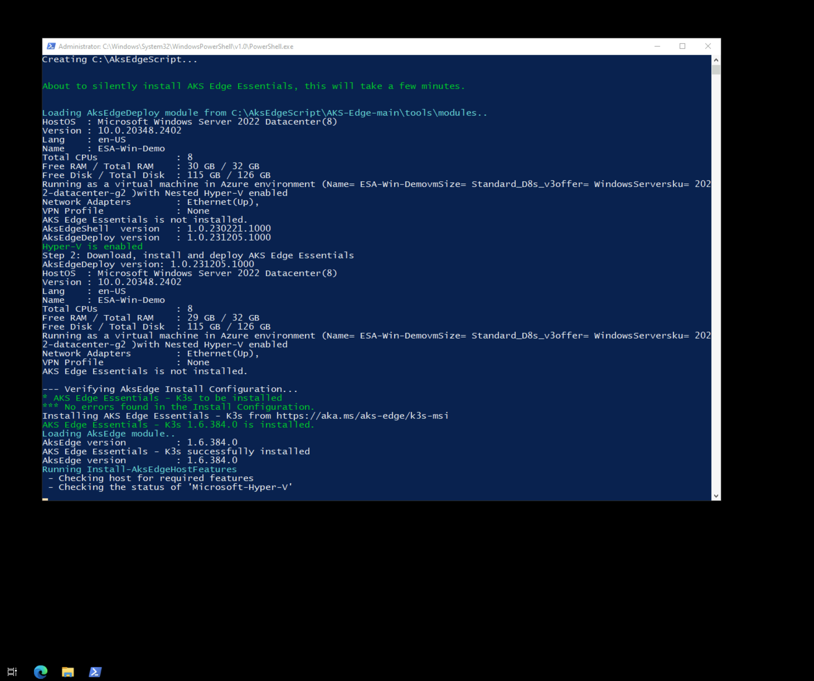
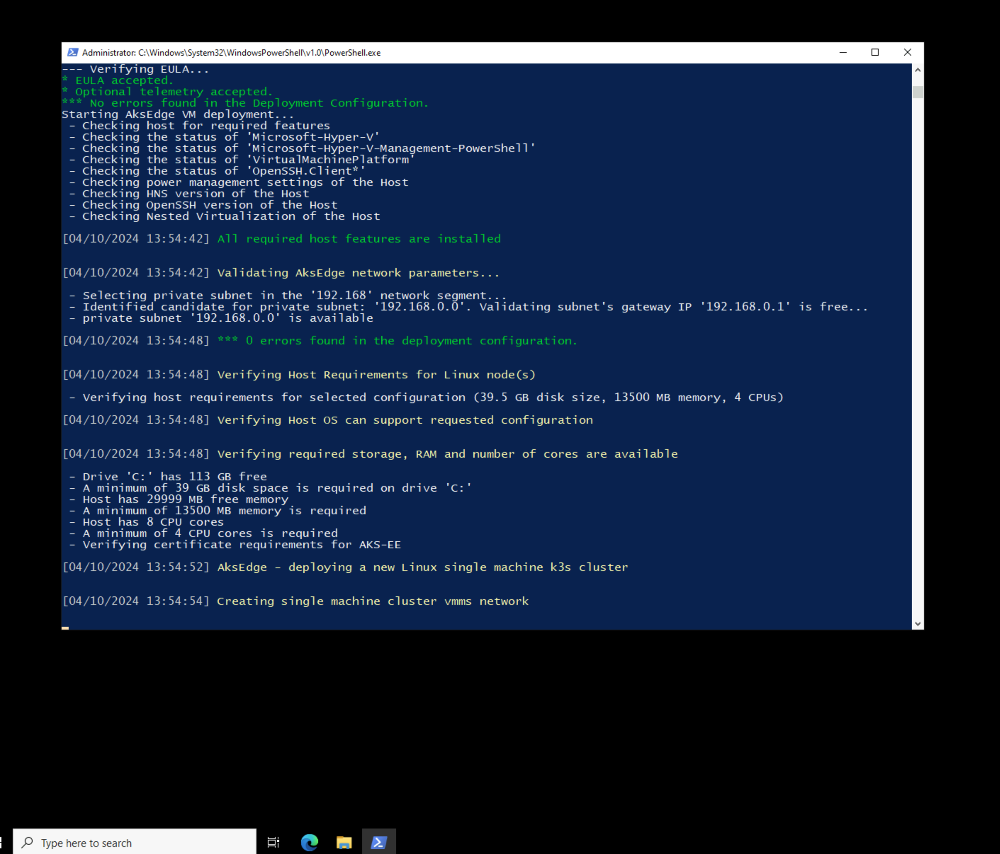
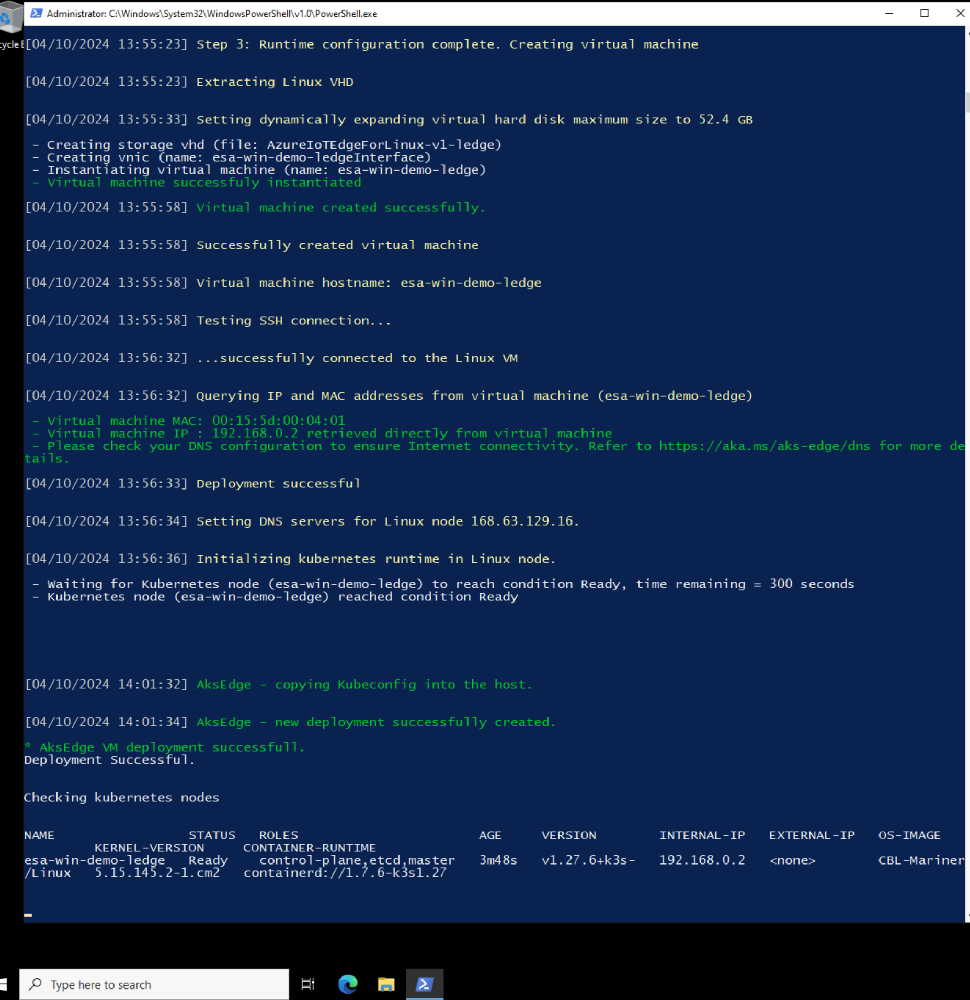
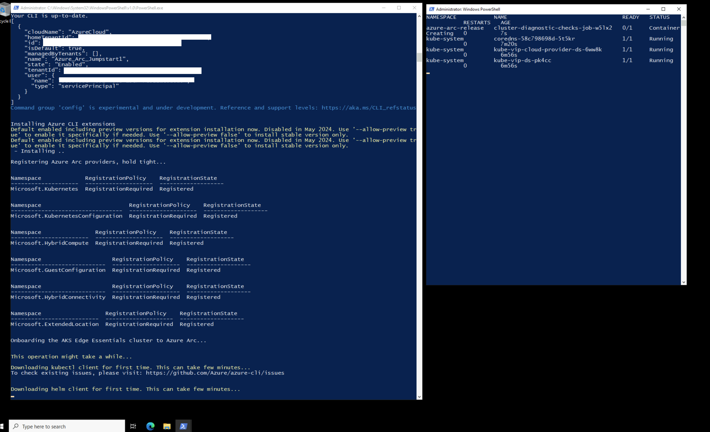
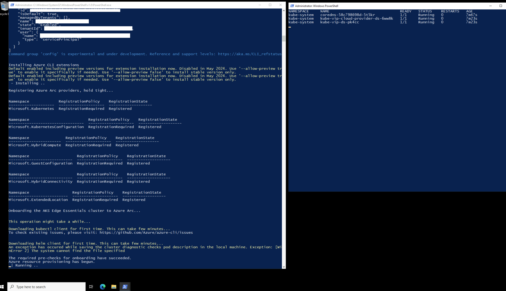
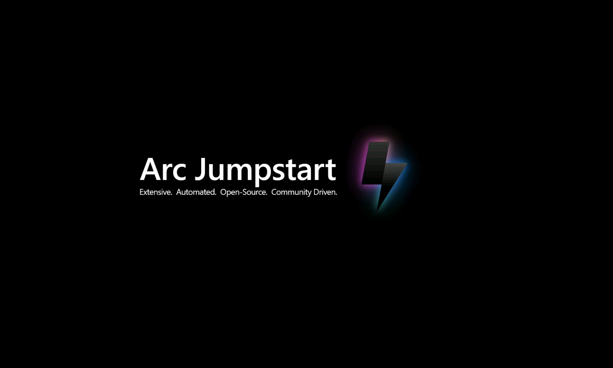
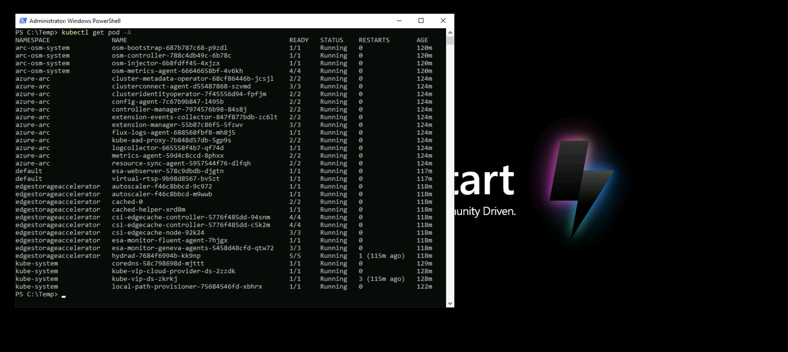
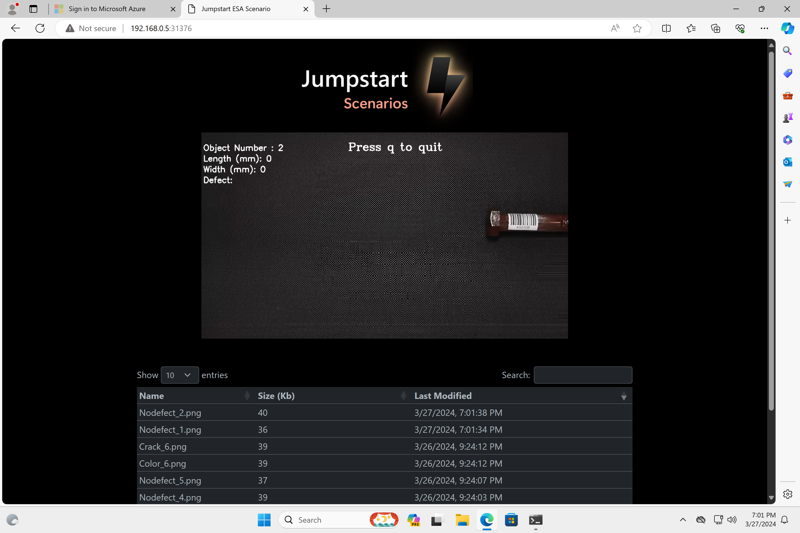

## Discover Edge Storage Accelerator on AKS Edge Essentials single node deployment 

The following Jumpstart scenario showcases Edge Storage Accelerator (ESA), which is a storage system designed for Arc-enabled Kubernetes clusters to provide reliable, fault tolerant storage in a ReadWriteMany persistent volume. The Edge Storage Accelerator provides a constantly connected conduit for edge data to be replicated in cloud on blob while maintaining a local copy, as space permits, for low latency local access. In this scenario, a model detects defects in bolts by analyzing video from a supply line streamed over RTSP. The identified defects are then stored in a container within a storage account using ESA.

This scenario will help you create deploy Edge Storage Accelerator by creating an AKS Edge Essentials single node deployment in an Azure Windows Server VM. The provided ARM template is responsible for creating the Azure resources as well as executing the LogonScript (AKS Edge Essentials cluster creation, Azure Arc onboarding (Azure VM and AKS Edge Essentials cluster) and Edge Storage Accelerator deployment) on the Azure VM. Once Edge Essentials is deployed [Edge Storage Accelerator](https://learn.microsoft.com/azure/azure-arc/edge-storage-accelerator/overview) is installed as a Kubernetes service that exposes a CSI driven storage class for use by applications in the Edge Essentials Kubernetes cluster.

Azure VMs leverage the [Azure Instance Metadata Service (IMDS)](https://learn.microsoft.com/azure/virtual-machines/windows/instance-metadata-service) by default to provide information about the VMs, and to manage and configure them. By projecting an Azure VM as an Azure Arc-enabled server, a "conflict" is created which will not allow the Azure Arc server resources to be represented as one resource when the IMDS is being used. Instead, the Azure Arc server will still "act" as a native Azure VM.

However, **for demo purposes only**, the below guide will allow you to use and onboard Azure VMs to Azure Arc. By doing so, you will be able to simulate a server that is deployed outside of Azure (i.e. "on-premises" or in other cloud platforms)

> **Note:** It is not expected for an Azure VM to be projected as an Azure Arc-enabled server. This configuration is unsupported and should ONLY be used for demo and testing purposes.


## Prerequisites

- [Install or update Azure CLI to version 2.53.0 and above](https://learn.microsoft.com/cli/azure/install-azure-cli?view=azure-cli-latest). Use the below command to check your current installed version.

  ```shell
  az --version
  ```

- In case you don't already have one, you can [Create a free Azure account](https://azure.microsoft.com/free/).

- Create Azure service principal (SP)

    To complete the scenario and its related automation, an Azure service principal with the “Contributor” role assigned is required. To create it, login to your Azure account and run the below command (this can also be done in [Azure Cloud Shell](https://shell.azure.com/).

    ```shell
    az login
    subscriptionId=$(az account show --query id --output tsv)
    az ad sp create-for-rbac -n "<Unique SP Name>" --role "Contributor" --scopes /subscriptions/$subscriptionId
    ```

    For example:

    ```shell
    az login
    subscriptionId=$(az account show --query id --output tsv)
    az ad sp create-for-rbac -n "JumpstartArc" --role "Contributor" --scopes /subscriptions/$subscriptionId
    ```

    Output should look like this:

    ```json
    {
    "appId": "XXXXXXXXXXXXXXXXXXXXXXXXXXXX",
    "displayName": "JumpstartArc",
    "password": "XXXXXXXXXXXXXXXXXXXXXXXXXXXX",
    "tenant": "XXXXXXXXXXXXXXXXXXXXXXXXXXXX"
    }
    ```

    > **Note:** If you create multiple subsequent role assignments on the same service principal, your client secret (password) will be destroyed and recreated each time. Therefore, make sure you grab the correct password.

    > **Note:** The Jumpstart scenarios are designed with ease of use in-mind and adhere to security-related best practices whenever possible. It is optional but highly recommended to scope the service principal to a specific [Azure subscription and resource group](https://learn.microsoft.com/cli/azure/ad/sp?view=azure-cli-latest) as well as considering use of a [less privileged service principal account](https://learn.microsoft.com/azure/role-based-access-control/best-practices).


## Automation Flow

The automation and deployment flow of the scenario proceeds as follows:

- User edits the ARM template parameters file (1-time edit). These parameter values are used throughout the deployment.

- Main [_azuredeploy_ ARM template](https://github.com/microsoft/azure_arc/blob/main/azure_edge_iot_ops_jumpstart/aio_esa/azuredeploy.json) will initiate the deployment of the following resources:

  - _Virtual Network_ - Virtual Network for Azure Windows Server VM.
  - _Network Interface_ - Network Interface for Azure Windows Server VM.
  - _Network Security Group_ - Network Security Group to allow RDP in Azure Windows Server VM.
  - _Virtual Machine_ - Azure Windows Server VM.
  - _Custom script and Azure Desired State Configuration extensions_ - Configure the Azure Windows Server VM to host AKS Edge Essentials.

- User remotes into client Windows VM, which automatically kicks off the [_LogonScript_](https://github.com/microsoft/azure_arc/blob/main/azure_edge_iot_ops_jumpstart/aio_esa/artifacts/LogonScript.ps1) PowerShell script to:
  - Create the AKS Edge Essentials cluster in the Windows Server VM
  - Onboard the Azure VM and AKS Edge Essentials cluster to Azure Arc
  - Deploy ESA and Fault Detection Model

## Deployment

As mentioned, this deployment will leverage ARM templates. You will deploy a single template, responsible for creating all the Azure resources in a single resource group as well onboarding the created VM to Azure Arc.

- Clone the Azure Arc Jumpstart repository

    ```shell
    git clone https://github.com/microsoft/azure_arc.git
    ```

- Before deploying the ARM template, login to Azure using Azure CLI with the *`az login`* command.

- The deployment uses the ARM template parameters file. Before initiating the deployment, edit the [_azuredeploy.parameters.json_](https://github.com/microsoft/azure_arc/blob/main/azure_edge_iot_ops_jumpstart/aio_esa/azuredeploy.parameters.json) file located in your local cloned repository folder.

  - _`vmSize`_ - Client Windows VM size.
  - _`vmName`_ - Client Windows VM name.
  - _`kubernetesDistribution`_ - Choice (k8s | k3s) kubernetes distribution.
  - _`windowsNode`_ - Choice (true | false) to deploy AKS Windows Node.
  - _`adminUsername`_ - Client Windows VM Administrator username.
  - _`adminPassword`_ - Client Windows VM Password. Password must have 3 of the following: 1 lower case character, 1 upper case character, 1 number, and 1 special character. The value must be between 12 and 123 characters long.
  - _`appId`_ - Your Azure service principal id.
  - _`password`_ - Your Azure service principal secret.
  - _`tenantId`_ - Your Azure tenant id.
  - _`subscriptionId`_ - Your Subscription ID.
  - _`location`_ - Azure location.
  - _`deployBastion`_ - Choice (true | false) to deploy [Azure Bastion](https://learn.microsoft.com/azure/bastion/bastion-overview) or not to connect to the client VM.
  - _`bastionHostName`_ - Azure Bastion name.
  - _`storageAccountName`_ - Azure Storage Account Name
  - _`storageContainer`_ - Container in Storage Account (Leave this unmodified for a quick deployment)

- To deploy the ARM template, navigate to the local cloned [deployment folder](https://github.com/microsoft/azure_arc/blob/main/azure_edge_iot_ops_jumpstart/aio_esa/) and run the below command:

    ```shell
    az group create --name <Name of the Azure resource group> --location <Azure Region>
    az deployment group create \
    --resource-group <Name of the Azure resource group> \
    --name <The name of this deployment> \
    --template-uri https://raw.githubusercontent.com/microsoft/azure_arc/main/azure_edge_iot_ops_jumpstart/aio_esa/azuredeploy.json \
    --parameters <The _azuredeploy.parameters.json_ parameters file location>
    ```

    > **Note:** Make sure that you are using the same Azure resource group name as the one you've just used in the _azuredeploy.parameters.json_ file.

    For example:

    ```shell
    az group create --name AKS-EE-ESA-Demo --location "East US"
    az deployment group create \
    --resource-group AKS-EE-ESA-Demo \
    --name akseedemo \
    --template-uri https://raw.githubusercontent.com/microsoft/azure_arc/main/azure_edge_iot_ops_jumpstart/aio_esa/azuredeploy.json \
    --parameters azuredeploy.parameters.json
    ```

    > **Note:** If you receive an error message stating that the requested VM size is not available in the desired location (as an example: 'Standard_D8s_v3'), it means that there is currently a capacity restriction for that specific VM size in that particular region. Capacity restrictions can occur due to various reasons, such as high demand or maintenance activities. Microsoft Azure periodically adjusts the available capacity in each region based on usage patterns and resource availability. To continue deploying this scenario, please try to re-run the deployment using another region.

- Once Azure resources have been provisioned, you will be able to see them in Azure portal.

    

    

## Windows Login & Post Deployment

Various options are available to connect to _AKS-EE-Demo_ Azure VM, depending on the parameters you supplied during deployment.

- [RDP](#connecting-directly-with-rdp) - available after configuring access to port 3389 on the _Arc-App-Client-NSG_, or by enabling [Just-in-Time access (JIT)](#connect-using-just-in-time-access-jit).
- [Azure Bastion](#connect-using-azure-bastion) - available if *`true`* was the value of your _`deployBastion`_ parameter during deployment.

### Connecting directly with RDP

By design, port 3389 is not allowed on the network security group. Therefore, you must create an NSG rule to allow inbound 3389.

- Open the _AKS-EE-Demo-NSG_ resource in Azure portal and click "Add" to add a new rule.

  

  

- Specify the IP address that you will be connecting from and select RDP as the service with "Allow" set as the action. You can retrieve your public IP address by accessing [https://icanhazip.com](https://icanhazip.com) or [https://whatismyip.com](https://whatismyip.com).

  

  

  

### Connect using just-in-time access (JIT)

If you already have [Microsoft Defender for Cloud](https://learn.microsoft.com/azure/defender-for-cloud/just-in-time-access-usage?tabs=jit-config-asc%2Cjit-request-asc) enabled on your subscription and would like to use JIT to access the Azure Client VM, use the following steps:

- In the Client VM configuration pane, enable just-in-time. This will enable the default settings.

  

  

### Connect using Azure Bastion

- If you have chosen to deploy Azure Bastion in your deployment, use it to connect to the Azure VM.

  

  > **Note:** When using Azure Bastion, the desktop background image is not visible. Therefore some screenshots in this guide may not exactly match your experience if you are connecting with Azure Bastion.

### Post Deployment

- At first login, as mentioned in the "Automation Flow" section, a logon script will get executed. This script was created as part of the automated deployment process.

- Let the script to run its course and **do not close** the Powershell session, this will be done for you once completed.

    > **Note:** The script run time is ~13min long.

    

    

    

    

    

    

    

    

    

- Upon successful run, a new Azure Arc-enabled server and Azure Arc-enabled Kubernetes cluster will be added to the resource group.


- You can also run _kubectl get nodes -o wide_ to check the cluster node status and _kubectl get pod -A_ to see that the cluster is running and all the needed pods (system, [the Arc-enabled Kubernetes extension pods](https://learn.microsoft.com/azure/azure-arc/kubernetes/extensions), and [Azure Monitor extension pods](https://learn.microsoft.com/azure/azure-monitor/containers/container-insights-overview) are in a running state.





## Edge Storage Accelerator Demo

Once installed, you will need to open a PowerShell on the AKS-EE-Win-Demo server and obtain the IP and service port for the demonstration application. 


Use the esa-webserver-svc EXTERNAL-IP and PORT to reach the application web frontend.



After the application runs, you can validate that the detected objects have been saved to your blob storage account container.


### Exploring logs from the Client VM

Occasionally, you may need to review log output from scripts that run on the _AKS-EE-Demo_ VM in case of deployment failures. To make troubleshooting easier, the scenario deployment scripts collect all relevant logs in the _C:\Temp_ folder on _AKS-EE-Demo_ Azure VM. A short description of the logs and their purpose can be seen in the list below:

| Log file | Description |
| ------- | ----------- |
| _C:\Temp\Bootstrap.log_ | Output from the initial _bootstrapping.ps1_ script that runs on _AKS-EE-Demo_ Azure VM. |
| _C:\Temp\LogonScript.log_ | Output of _LogonScript.ps1_ which creates the AKS Edge Essentials cluster, onboard it with Azure Arc creating the needed extensions as well as onboard the Azure VM. |
|


## Cleanup

- If you want to delete the entire environment, simply delete the deployment resource group from the Azure portal.

    
