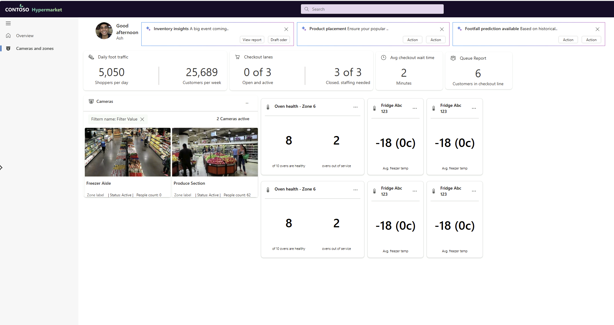

# Overview

Maintenance workers, equipment managers, and production engineers at Contoso Hypermarket use real-time interactive dashboards to operate, monitor, maintain, and service all aspects of industrial assets such as refrigerators, HVAC. BReal-time data and insights are available through dashboards  they can proactively address potential issues, perform predictive maintenance, and ensure the optimal performance of industrial assets. This reduces downtime and extends the lifespan of the equipment.

By integrating these observability components, Contoso Hypermarket can maintain high operational standards, reduce maintenance costs, and improve overall efficiency. This holistic approach to asset management ensures that all industrial assets are functioning optimally, contributing to the smooth operation of the hypermarket.

## View industrial assets health in an app

Maintenance workers and equipment managers can view the status and health of Contoso Hypermarket's critical production assets such as refrigerators, ovens, and [HVAC](https://en.wikipedia.org/wiki/Heating,_ventilation,_and_air_conditioning) units. Follow the instructions below to see this experience in action.

- Open Microsoft Edge on the _Ag-Client_VM_ desktop and then click on the bookmarks toolbar and find the bookmark folder for Main UI.

    

- Click on the link for Maintenance Workers

    

- In this screen, maintenance workers can view the health of ovens, refrigerators, and point-of-sale assets such as automated checkouts or smart shelves.

    

>**Note:** Some user interface widgets are cosmetic only and not specifically implemented in this release of Contoso Hypermarket.

- Users can also interact with Contoso Hypermarket using natural language. Click on the [Jumpstart Cerebral](../../cerebral/) icon in the upper right to ask a question about the status of industrial assets.

    

    

## View industrial assets health in a Grafana dashboard

Users also have the ability to use [Grafana](https://grafana.com/) to build, view and customize dashboards for industrial assets telemetry.

## Observability architecture components

Contoso Hypermarket uses several observability components to monitor and manage industrial assets such as refrigerators, ovens, HVACs, and retail smart shelves. The key components used are:

- [**Azure IoT Operations**](): Facilitates the connection and management of IoT devices, enabling real-time monitoring and control of industrial assets.
- [**MQTT**](): A lightweight messaging protocol used for efficient communication between IoT devices and the cloud.
- [**Prometheus**](): An open-source monitoring and alerting toolkit used to collect and store metrics from industrial assets.
- [**Grafana**](): A multi-platform open-source analytics and interactive visualization web application used to create dashboards and graphs from the metrics collected by Prometheus.
- [**Microsoft PowerBI**](): A business analytics service that provides interactive visualizations and business intelligence capabilities with an interface simple enough for end users to create their own reports and dashboards.

These components work together to provide a comprehensive view of the status and health of industrial assets, ensuring optimal performance and quick identification of any issues.

## Next steps

[Shopper insights](../shopper_insights/) - Learn how Contoso Hypermarket uses AI 