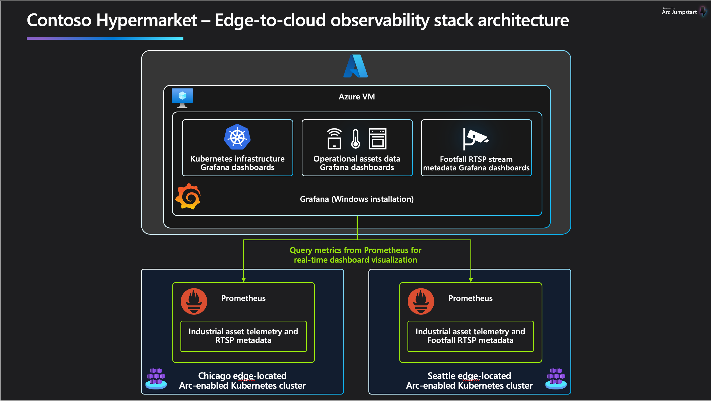
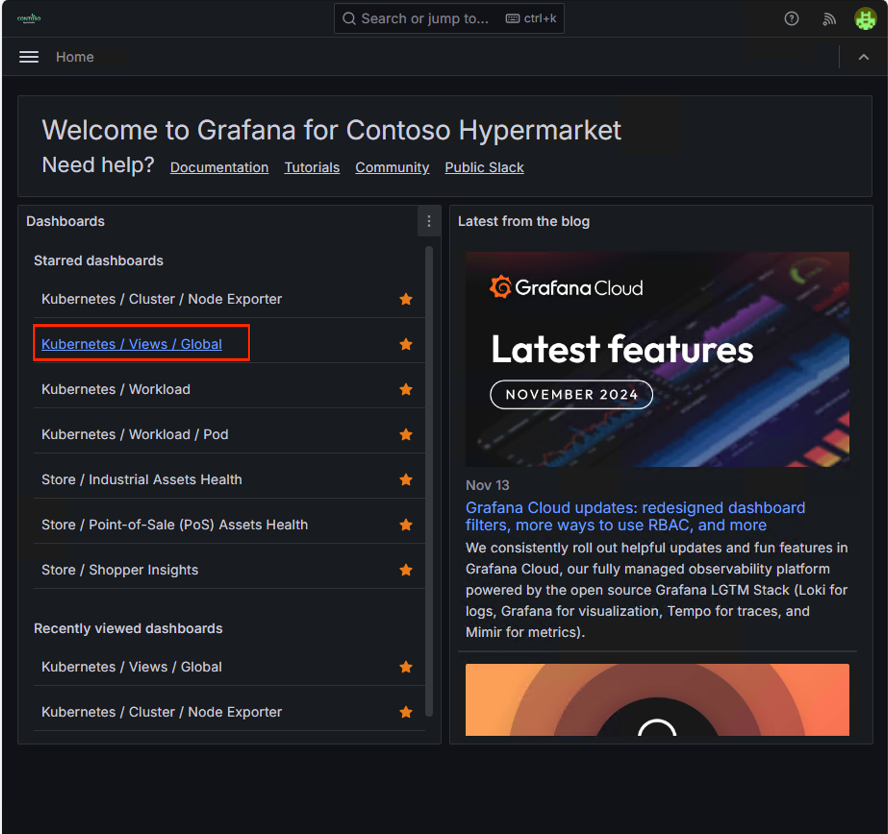
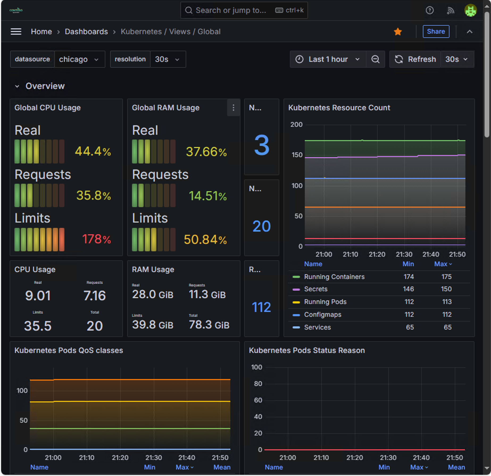
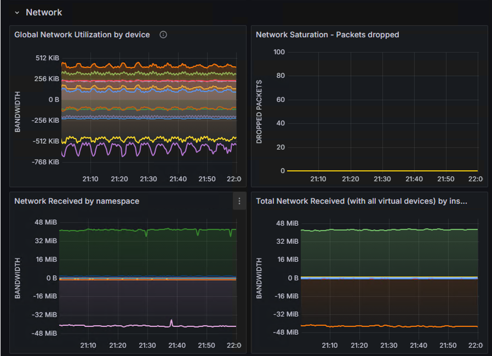
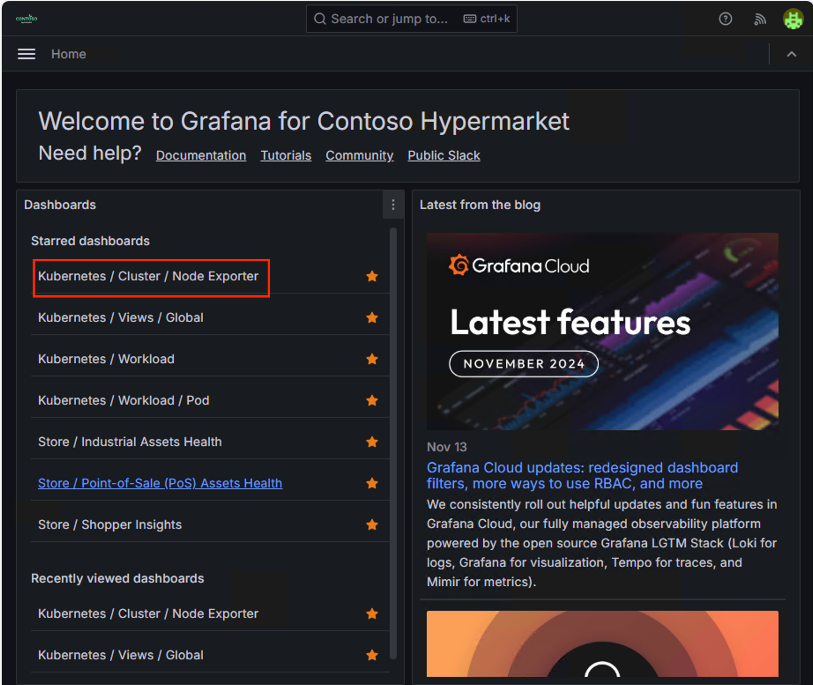
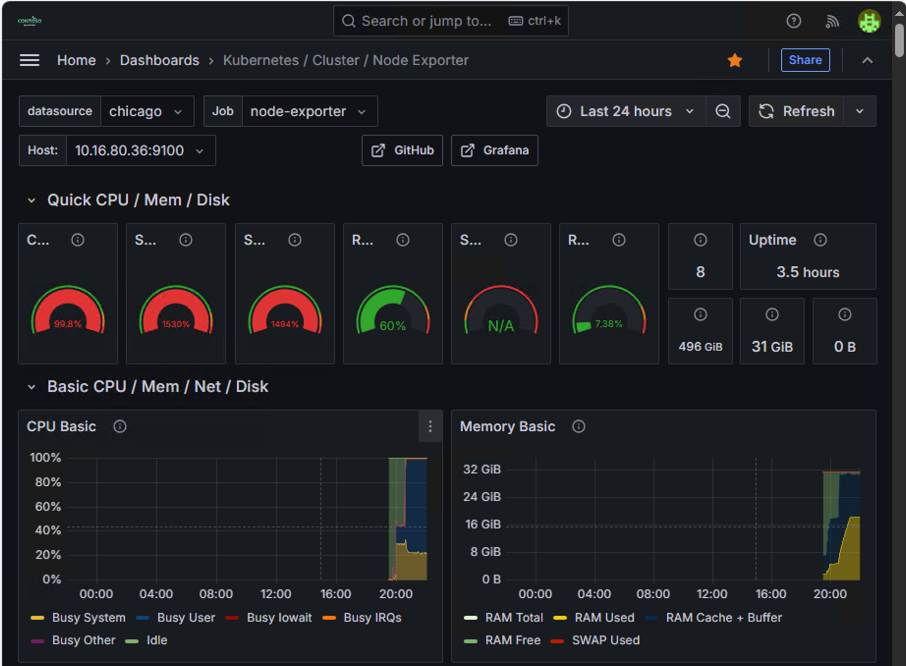
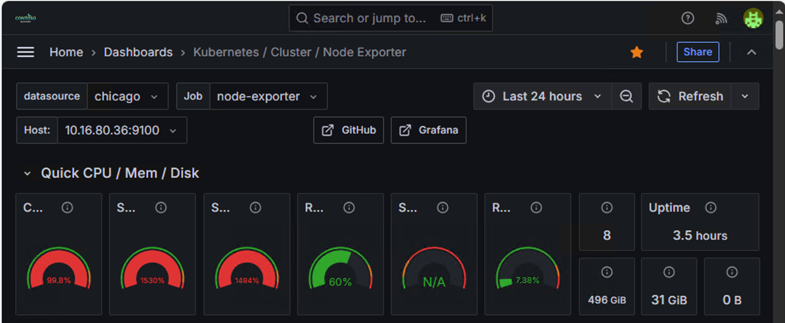

# Infrastructure observability for Arc-enabled Kubernetes

## Overview

Infrastructure observability is essential for the success of Contoso Hypermarket's cloud-to-edge strategy. By using various tools for infrastructure observability, Contoso Hypermarket is able to monitor and visualize the health of their Kubernetes and Arc-enabled Kubernetes environments. This allows them to proactively oversee the health and performance of their infrastructure, identify potential issues, and make data-driven decisions to optimize their operations. With infrastructure observability, Contoso can ensure that their cloud and edge infrastructure remains reliable, efficient, and resilient.

[Prometheus](https://prometheus.io/) is an efficient open-source monitoring system that collects and stores metrics from various sources in real-time. It offers a flexible query language for analyzing the collected metrics and provides robust alerting capabilities. Meanwhile, [Grafana](https://grafana.com/) is a powerful open-source data visualization and analytics platform that allows users to create interactive and customizable dashboards to visualize the collected metrics in real-time.

By using Prometheus and Grafana for infrastructure observability, Contoso benefits in three key ways:

- First, Prometheus's efficient data collection ensures that Contoso can monitor critical performance indicators and resource utilization in real-time.
- Second, Grafana offers a user-friendly interface for visualizing the collected metrics, enabling Contoso to create interactive and customizable dashboards. These dashboards provide valuable insights into their infrastructure’s health and performance, facilitate trend identification, and support informed decision-making.
- Third, the combination of Prometheus and Grafana aids in troubleshooting and root cause analysis.

## Architecture

The architecture of the observability infrastructure stack uses the [Kube Prometheus Stack](https://github.com/prometheus-community/helm-charts/tree/main/charts/kube-prometheus-stack). This stack is comprised of Kubernetes manifests, Grafana dashboards, and Prometheus rules, which are easily deployed and provide end-to-end monitoring of Kubernetes clusters.

In the store locations, Prometheus instances are deployed to periodically collect metrics from the K3s cluster. A separate Grafana instance is set up to centralize monitoring and visualization. The Prometheus instances send metrics data to this central Grafana instance. Grafana dashboards are then configured to display relevant metrics, enabling operators and administrators to monitor the health and performance of the entire infrastructure.

## Grafana dashboards

Grafana's dashboards in Contoso's implementation provide a visually appealing and customizable interface for monitoring their infrastructure. With Grafana, they can create intuitive and interactive dashboards that display key metrics and insights, empowering them to make data-driven decisions and quickly identify any issues or trends within their cloud to edge infrastructure. The following Grafana dashboards are automatically deployed as part of advanced automation for all the manufacturing plants:

- **Kubernetes / Views / Global**: The Kubernetes Global Dashboard in Grafana offers a concise overview of your Kubernetes cluster, allowing you to quickly assess its overall health and performance. The dashboard includes panels that highlight key metrics, such as total cluster CPU, RAM, and network utilization, as well as resource usage across namespaces and nodes. Additionally, it tracks the number of resource types used in the cluster and helps detect misconfigured application resources by comparing real usage with requested and limited resources.

- **Node Exporter Full**: The Kubernetes Nodes Dashboard in Grafana provides a detailed view of node-level metrics and resources in your Kubernetes cluster. It enables you to monitor CPU and RAM usage, track pods running on each node, and identify any resource anomalies or performance issues. The dashboard also offers system-level metrics such as system load, context switches, and file descriptors, allowing for troubleshooting and optimization. Additionally, it provides insights into storage capacity, volumes, and I/O operations on the nodes, aiding in the effective management of storage resources.

> **Grafana Dashboard Credits:**
> The Kubernetes dashboards included in this guide are based on the work of publicly available dashboards. We would like to express our appreciation for authors' efforts in creating this insightful dashboard that enhances our monitoring capabilities for Kubernetes.
> The original dashboards can be found at:
> - [Node Exporter Full](https://grafana.com/grafana/dashboards/1860-node-exporter-full)
> - [Grafana Dashboards Kubernetes](https://github.com/dotdc/grafana-dashboards-kubernetes)

## Accessing dashboards

To view the health of the Kubernetes clusters, access the Grafana dashboards by doing the following:

- Connect to the Client VM _Ag-VM-Client_ using the instruction in the [deployment guide](../deployment/)

- Open the Edge browser, expand Grafana in the Favorites Bar and select **Grafana**

    

- Login using the Windows Admin Username and Password you provided when you created your deployment.

    

- Click on the `Kubernetes / Views / Global` dashboard to review the health of the two clusters.

    
  
    

- Review the different panels in the dashboard to see the metrics collected from the Kubernetes cluster.

    

    

- Click `Home` to go back to the home page and review the other dashboards available.

    

- Click `Kubernetes / Views / Node Exporter` dashboard to review the cluster node metrics.

    

    

- Review the different panels in the dashboard to see the metrics collected from the Kubernetes cluster.

    

    

    

- Repeat the same steps to access the `Seattle` cluster by selecting this cluster from the _datasource_ dropdown.

    

## Next steps

- Learn how to use [Grafana to view metrics](../shopper_insights/) on shopper behavior
- For more information on configuring Grafana dashboards, please refer to [Create a dashboard](https://grafana.com/docs/grafana/latest/dashboards/build-dashboards/create-dashboard/)
- For information on the Azure Managed Grafana service, please refer to [What is Azure Managed Grafana?](https://learn.microsoft.com/azure/managed-grafana/overview)
