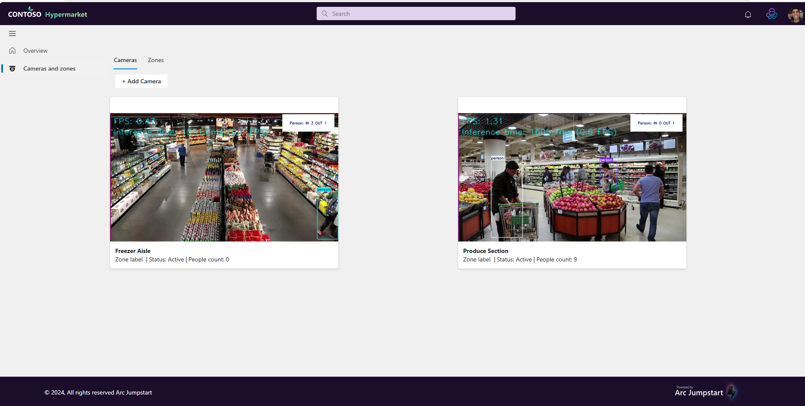
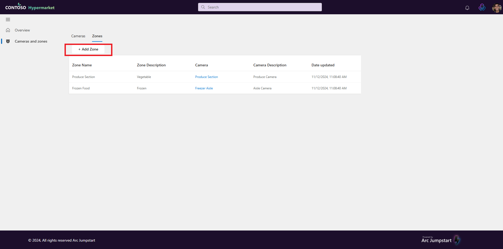
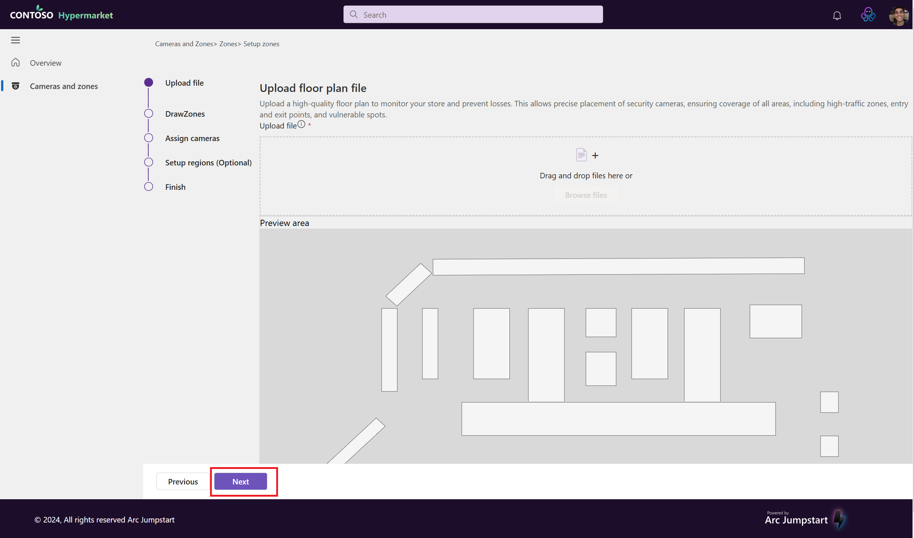
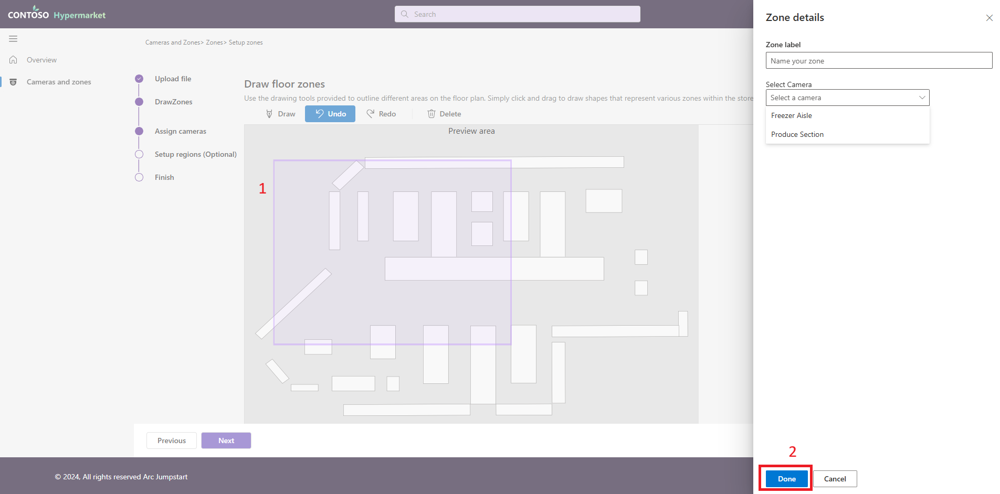

## Enhance store operations and boost sales with AI-enhanced shopper insights

Contoso Hypermarket uses computer vision to enhance the customer in-store experience and to provide advanced business insights that can make store operations more efficient, increase sales, and streamline operations. In-store cameras detect shopper behavior such as foot traffic, time spent in certain zones of the store, and shopper-specific identifiers that personalize the shopping experience.

### Shopper insights for store managers

Store managers can view foot traffic for a store using the Store Manager dashboard. This includes identifying high traffic areas within the store, which helps in optimizing store layout and product placement. In-store cameras can be mapped to specific "zones" which are then used to sort foot traffic into specific groups of shopper foot traffic.

#### Configure cameras, zones and regions

The specific region of the camera field-of-view that will be sent for inferencing can be controlled on a per-camera basis. This is done by managing cameras, zones and camera regions. The following steps provides the details.

- For configuring cameras, the first step is to visit "/cameraszones" page. That will bring up the following page:

    

- To add new camera, click "+Add Camera" button which will open a side panel to provide details about the new camera. Following image illustrates that step:

    

    Once a new camera is added, it would be listed on the same _"/cameraszones"_ page as shown above.

- Zones are areas or locations in a building where the cameras would be deployed to. To manage zones, visit _"/cameraszones"_ and clicking the "Zones" tab as shown below:

    

    This will list all the zones that are available as shown below:

    

- In order to create a new zone click "+Add Zone" button as shown in the above screenshot. This will start the a set up wizard for zones.

- The first step for the setup wizard for zones is for uploading a floor plan. Clicking the "+Add Zone" will show the page for uploading a floor plan as shown below:

    

- Clicking the "Next" button in the upload floor plan page, will take the user to "Draw floor zones" page as shown below:

    

    The draw floor zones page allows user to draw a zone on the uploaded floor plan.

- To draw a zone on a floorplan, click any area (any area under the toolbar in the screenshot show above) and then drag the mouse down to create a rectangle. Once the rectangle is created, the selected area will be highlighted on the floor plan and a panel on the right would appear.

- Enter a zone label and select a particular camera for the new zone that is being created.

    

- Once the zone label and desired camera for the new zone is selected, click "Done" as highlighed in the above screenshot.

- After setting up the zone, the next is to setup camera region. Clicking "Done" button in the previous step will bring the user to the page that allows user to select a camera. Once a camera is selected, the video feed from that camera appears as shown below:

    

    The setup camera region will allow user to create bounding box within the camera's video feed. The bounding box is the region that inferencing will be run agains.

- To create bounding box, click any where on the video and then drag the mouse to draw a rectangle. Once a rectangle is drawn on the video feed, a purple bordered box with light purple tint will appear depicting the bounding box. This is show in the following screenshot:

    

- Click "Next" button to move to the Review Summary page.

    

    The review summary shows the zones that we have added and the cameras that have been setup.

- Click "Save" to complete the wizard.

### Regional manager / data analyst

The regional manager will leverage the footfall and shopper insights data from various stores through aggregated dashboards in Fabric. These dashboards provide a comprehensive view of shopper behaviors and patterns across multiple locations, enabling the regional manager to identify trends and make informed decisions. By analyzing high traffic areas, peak shopping times, and customer preferences, the regional manager can optimize store layouts, improve product placement, and tailor marketing strategies to enhance the overall shopping experience. Additionally, the insights gathered from the dashboards help in identifying operational inefficiencies and areas for improvement, ensuring that each store operates at its best.

Further reading:

- [Observability](../observability/_index.md) - Visualize shopper foot traffic and behavior patterns in Grafana dashboards
- [Contoso Hypermarket edge-to-cloud data pipeline](../data_pipeline/_index.md) - Understand how indivudal store data is sent from edge-to-cloud and analyzed using Microsoft Fabric.

### Architecture

#### Video inferencing pipeling

- Footfall API
- Shopper Insights API
- Data pipeline to MQ

### Jump to other Contoso Hypermarket guides

[Deployment](../deployment/_index.md)
[Commercial gen-AI](../cerebral/_index.md)
[Observability](../observability/_index.md)
[Predictive Analytics](../predictive_analytics/_index.md)
[Speech-to-text](../speech_to_text/_index.md)
[Cleanup](../cleanup/_index.md)
[Troubleshooting](../troubleshooting/_index.md)
