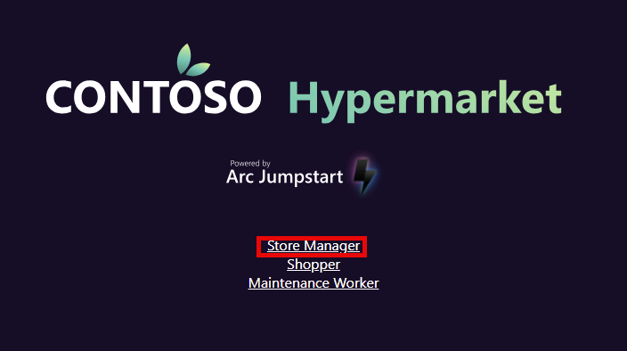
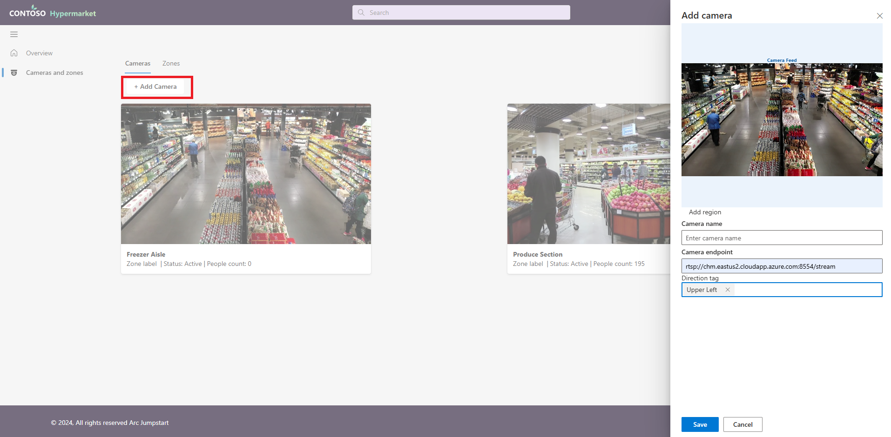
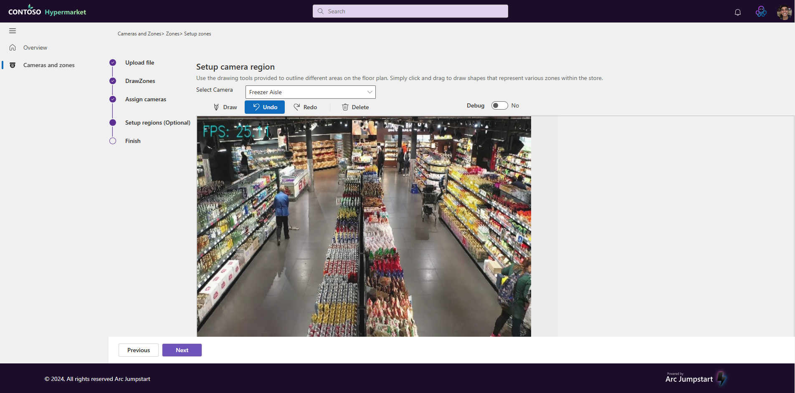
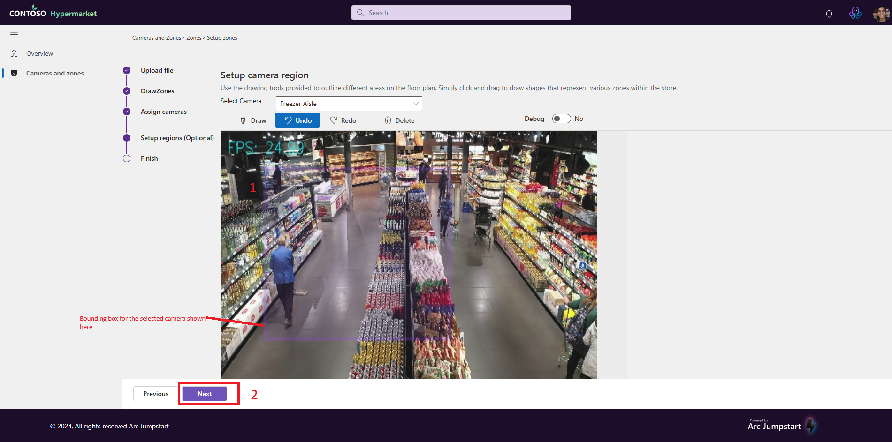
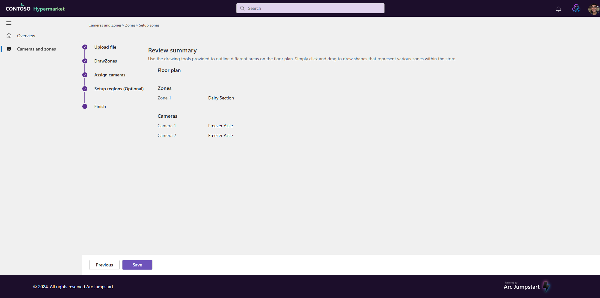
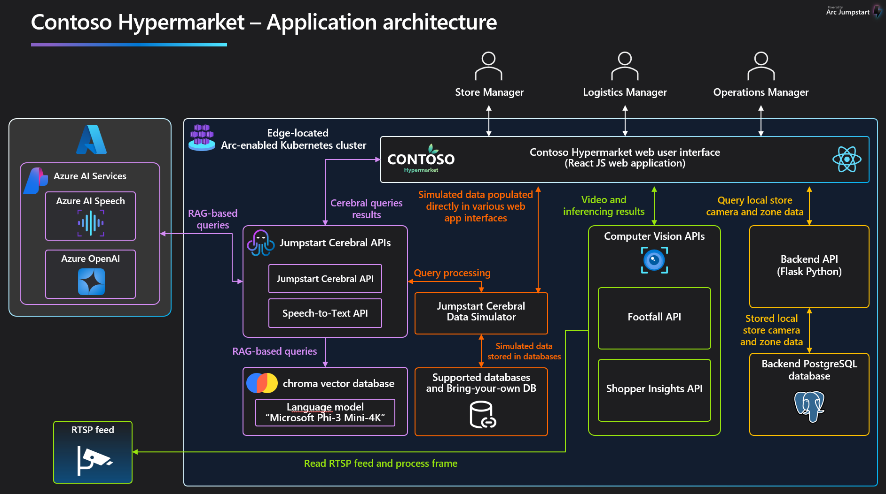

# Enhance store operations and boost sales with AI-enhanced shopper insights

## Overview

Contoso Hypermarket uses computer vision to enhance the customer in-store experience and to provide advanced business insights that can make store operations more efficient, increase sales, and streamline operations. In-store cameras detect shopper behavior such as foot traffic, time spent in certain zones of the store, and shopper-specific identifiers that personalize the shopping experience.

### Shopper insights for store managers

Store managers can view foot traffic for a store using the Store Manager dashboard. This includes identifying high traffic areas within the store, which helps in optimizing store layout and product placement. In-store cameras can be mapped to specific "zones" which are then used to sort foot traffic into specific groups of shopper foot traffic.

- Open Microsoft Edge on the _Ag-Client_VM_ desktop and then click on the bookmarks toolbar and find the bookmark folder for Main UI.

    

- Click on the link for Store Managers

    

#### Configure cameras, zones and regions

The specific region of the camera field-of-view that will be sent for inference can be controlled on a per-camera basis. This is done by managing cameras, zones and camera regions. Cameras are placed in retail store locations to monitor shopper behaviors and inventory. Cameras can be assigned a "zone" which represents a physical area of the store. Cameras also have defined "regions" which represent a defined bounding box inside the camera field of view that will be sent for inference.

- To add new camera, click "Add Camera" button which will open a side panel to provide details about the new camera. Two [simulated cameras](https://github.com/kerberos-io/virtual-rtsp) are provided as part of the deployment which display videos of a typical grocery store.

    

- Zones represents a physical area of the store. To create zones, click the "Zones" tab, then click the "Add Zone" button. This will start the a set up wizard for zones.

    

- Upload a floor plan. You can find a sample floorplan in the "C:\Ag\" folder on _Ag_Client_VM_. Click next when ready to continue.

    

- Zones are created by clicking and dragging the mouse on the floorplan image. You can provide your own floorplan image if desired.

    

- To draw a zone on a floorplan, click any area (any area under the toolbar in the screenshot show above) and then drag the mouse down to create a rectangle. Once the rectangle is created, the selected area will be highlighted on the floor plan and a panel on the right lets you provide a zone label and select a particular camera for the new zone that's being created. Click done when ready.

    

- After setting up the zone, the next is to setup a camera region bounding box. Once a camera is selected, the video feed from that camera appears. The camera region will allow user to create bounding box within the camera's video feed. The bounding box is the region of view sent for inference jobs.

    

- To create bounding box, click any where on the video and then drag the mouse to draw a rectangle. Once a rectangle is drawn on the video feed, a purple bordered box with light purple tint will appear depicting the bounding box. This is show in the following screenshot:

    

- Click the "Next" button to move to the Review Summary page, then click Save to complete the camera setup wizard.

    .

### Architecture

Contoso Hypermarket uses an [adaptive cloud](https://techcommunity.microsoft.com/blog/azurearcblog/a-guide-to-adaptive-cloud-at-microsoft-ignite-2024/4285028) application architecture to use AI in their business and day-to-day store operations. collect and use shopper insights about their retail locations. The diagram illustrates the overall architecture of the Shopper Insights system and the relation of the computer vision APIs relative to other solution components.

#### Video inference pipeline

Video inference is handled by two APIs using a common pattern.

- **Footfall API**: Detects humans in a specified region of a camera using [YOLOv8](https://docs.ultralytics.com/models/yolov8/) and makes the inference results available via API call.
- **Shopper Insights API**: Detects and identifies individuals in a specified region of a camera using [OpenVINO](). It has the ability to track multiple people simultaneously, maintaining unique IDs for each detected person and providing metrics about customer movements, demographics, and interactions within defined areas.

- Footfall API - Uses basic object detection with YOLOv8 and the COCO dataset to detect people and other objects in a retail setting
- Shopper Insights API - Uses OpenVINO™ to provide metrics about customer movements, demographics, and interactions within defined areas. It has the ability to track multiple people simultaneously, maintaining unique IDs for each detected person.

#### Models Used

Person re-identification is a critical computer vision task that involves recognizing and tracking the same individual across different camera views or time periods. The following models are used in the footfall and shopper insights APIs.

- Person Detection Model - [person-detection-retail-0013](https://docs.openvino.ai/2022.3/omz_models_model_person_detection_retail_0013.html)
  - Detects people in video frames
  - High accuracy for retail environments

- Person Re-identification Model - [person-reidentification-retail-0287](https://docs.openvino.ai/2022.3/omz_models_model_person_reidentification_retail_0287.html)
  - Generates unique feature vectors for tracked individuals
  - Optimized for retail scenarios
  - Robust to viewpoint changes
  - Handles partial occlusions

- Age Recognition Model - [age-gender-recognition-retail-0013](https://docs.openvino.ai/2022.3/omz_models_model_age_gender_recognition_retail_0013.html)
  - Estimates age of detected persons
  - Groups ages into decades for statistics
  - Provides real-time demographic insights

### Jump to other Contoso Hypermarket guides

[Deployment](../deployment/_index.md)
[Commercial gen-AI](../cerebral/_index.md)
[Observability](../observability/_index.md)
[Predictive Analytics](../predictive_analytics/_index.md)
[Speech-to-Text](../speech_to_text/_index.md)
[Cleanup](../cleanup/_index.md)
[Troubleshooting](../troubleshooting/_index.md)
