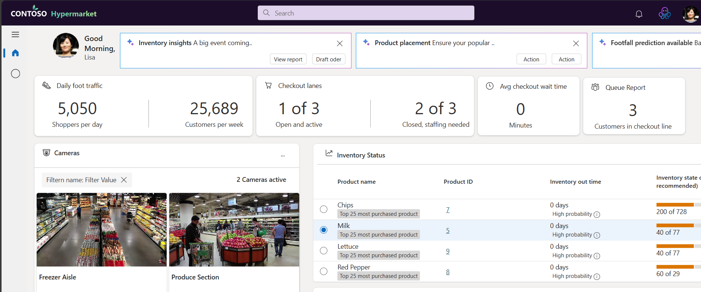
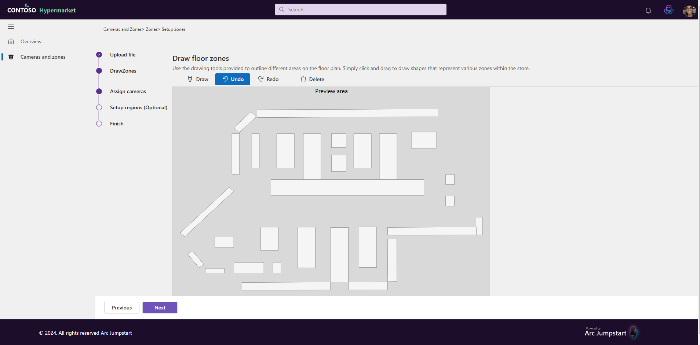

## Enhance store operations and boost sales with AI-enhanced shopper insights

Contoso Hypermarket uses computer vision to enhance the customer in-store experience and to provide advanced business insights that can make store operations more efficient, increase sales, and streamline operations. In-store cameras detect shopper behavior such as foot traffic, time spent in certain zones of the store, and shopper-specific identifiers that personalize the shopping experience.

### Shopper insights for store managers

Store managers can view foot traffic for a store using the Store Manager dashboard. This includes identifying high traffic areas within the store, which helps in optimizing store layout and product placement. In-store cameras can be mapped to specific "zones" which are then used to sort foot traffic into specific groups of shopper foot traffic.

- Open Microsoft Edge on the _Ag-Client_VM_ desktop and then click on the bookmarks toolbar and find the bookmark folder for Main UI.

    

- Click on the link for Store Managers

    

#### Configure cameras, zones and regions

The specific region of the camera field-of-view that will be sent for inference can be controlled on a per-camera basis. This is done by managing cameras, zones and camera regions. The following steps provides the details.

- For configuring cameras, the first step is to visit "./img/cameraszones" page. That will bring up the following page:

    

- To add new camera, click "+Add Camera" button which will open a side panel to provide details about the new camera. Following image illustrates that step:

    

    Once a new camera is added, it would be listed on the same _"/cameraszones"_ page as shown above.

- Zones are areas or locations in a building where the cameras would be deployed to. To manage zones, visit _"/cameraszones"_ and clicking the "Zones" tab as shown below:

    

    This will list all the zones that are available as shown below:

    

- In order to create a new zone click "+Add Zone" button as shown in the above screenshot. This will start the a set up wizard for zones.

- The first step for the setup wizard for zones is for uploading a floor plan. Clicking the "+Add Zone" will show the page for uploading a floor plan as shown below:

    

- Clicking the "Next" button in the upload floor plan page, will take the user to "Draw floor zones" page as shown below:

    

    The draw floor zones page allows user to draw a zone on the uploaded floor plan.

- To draw a zone on a floorplan, click any area (any area under the toolbar in the screenshot show above) and then drag the mouse down to create a rectangle. Once the rectangle is created, the selected area will be highlighted on the floor plan and a panel on the right would appear.

- Enter a zone label and select a particular camera for the new zone that's being created.

    

- Once the zone label and desired camera for the new zone is selected, click "Done" as highlighted in the above screenshot.

- After setting up the zone, the next is to setup camera region. Clicking "Done" button in the previous step will bring the user to the page that allows user to select a camera. Once a camera is selected, the video feed from that camera appears as shown below:

    

    The setup camera region will allow user to create bounding box within the camera's video feed. The bounding box is the region that inferencing will be run agains.

- To create bounding box, click any where on the video and then drag the mouse to draw a rectangle. Once a rectangle is drawn on the video feed, a purple bordered box with light purple tint will appear depicting the bounding box. This is show in the following screenshot:

    

- Click "Next" button to move to the Review Summary page.

    

    The review summary shows the zones that you added and the cameras that have been setup.

- Click "Save" to complete the wizard.

### Regional Manager / Data Analyst

The regional manager will leverage the footfall and shopper insights data from various stores through aggregated dashboards in Fabric. These dashboards provide a comprehensive view of shopper behaviors and patterns across multiple locations, enabling the regional manager to identify trends and make informed decisions. By analyzing high traffic areas, peak shopping times, and customer preferences, the regional manager can optimize store layouts, improve product placement, and tailor marketing strategies to enhance the overall shopping experience. Additionally, the insights gathered from the dashboards help in identifying operational inefficiencies and areas for improvement, ensuring that each store operates at its best.

### Architecture

Contoso Hypermarket uses an [adaptive cloud]() application architecture to use AI in their business and day-to-day store operations. collect and use shopper insights about their retail locations. The diagram illustrates the overall architecture of the Shopper Insights system.

#### Video inference pipeline

Video inferencing is handled by two APIs using a common pattern.

- **Footfall API**: Detects humans in a specified region of the field of view of an camera using [YOLOv8](https://docs.ultralytics.com/models/yolov8/) and makes the inference results available via API call.
- **Shopper Insights API**: 

- Footfall API
- Shopper Insights API

The Shopper Insights System is an advanced computer vision solution that provides real-time analytics about shopper behavior using video feeds. The system leverages OpenVINO™ for efficient AI model inference and provides detailed metrics about customer movements, demographics, and interactions within defined areas.
Key Features

### Real-time Person Detection

- Tracks multiple people simultaneously
- Maintains unique IDs for each detected person
- Processes video feeds at optimized FPS rates

### Person Re-identification (ReID)

Person re-identification is a critical computer vision task that involves recognizing and tracking the same individual across different camera views or time periods. In our system, we use the following approach:

### Feature Extraction

When a person is detected, the system extracts a unique feature vector (embedding)
These features capture distinctive characteristics like:

- Clothing patterns and colors
- Body shape and proportions
- Appearance attributes

### Feature Matching

New detections are compared with existing tracks using cosine distance
Distance threshold: 0.3 (configured in max_distance_threshold)
Lower distance indicates higher similarity

### Track Management

Each person gets a unique hash ID (8 characters)
Tracks are maintained for up to 60 frames (max_frames_to_track)
System handles track creation, updates, and termination

### Models Used
1. Person Detection Model
Model: person-detection-retail-0013

Purpose: Detects people in video frames
Architecture: MobileNetV2-like backbone with FPN and SSD head
Input: Images of 320×320 pixels
Output: Bounding boxes with confidence scores
Performance:

- High accuracy for retail environments
- Minimum confidence threshold: 0.6 (min_detection_confidence)

2. Person Re-identification Model
Model: person-reidentification-retail-0287

Purpose: Generates unique feature vectors for tracked individuals
Architecture: ResNet50 backbone optimized for ReID
Input: Cropped person images
Output: 256-dimensional feature vector
Features:

- Optimized for retail scenarios
- Robust to viewpoint changes
- Handles partial occlusions

3. Age Recognition Model
Model: age-gender-recognition-retail-0013

Purpose: Estimates age of detected persons
Architecture: Based on VGG-16 architecture
Input: Face/person crops
Output: Age estimation (0-100 years)
Features:

- Groups ages into decades for statistics
- Provides real-time demographic insights

### Area Analytics

- Supports multiple detection areas
- Tracks entry/exit times for each area
- Maintains current and total visitor counts

### Demographics Analysis

- Age detection for each detected person
- Age group statistics and trends
- Historical data aggregation

- Data pipeline to MQ

### Jump to other Contoso Hypermarket guides

[Deployment](../deployment/_index.md)
[Commercial gen-AI](../cerebral/_index.md)
[Observability](../observability/_index.md)
[Predictive Analytics](../predictive_analytics/_index.md)
[Speech-to-Text](../speech_to_text/_index.md)
[Cleanup](../cleanup/_index.md)
[Troubleshooting](../troubleshooting/_index.md)
