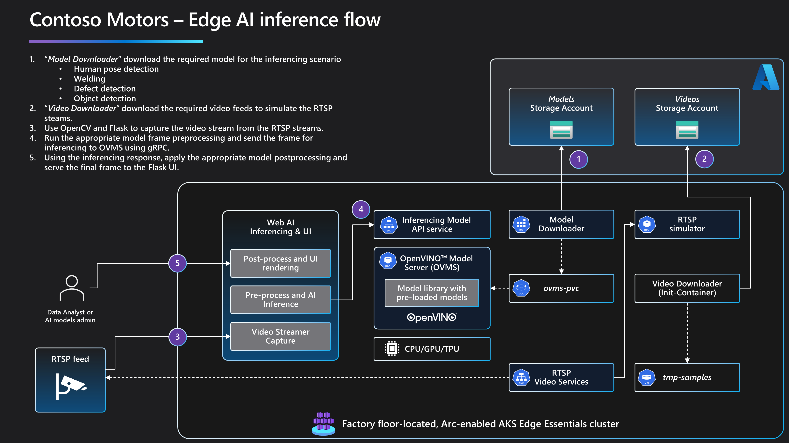
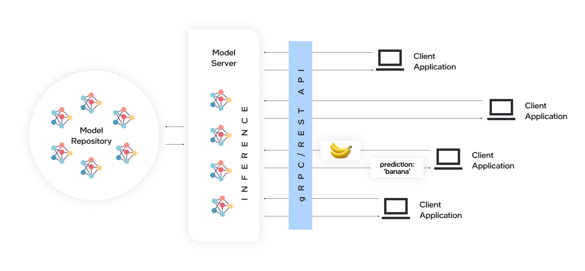

# Jumpstart Agora - Contoso Motors Web UI & AI Inference

Contoso Motors leverages AI-powered manufacturing with a Kubernetes-based infrastructure which provides a flexible and scalable design that can be easily extended. This document covers how Contoso Motors implements different AI inferencing models for various use cases, leveraging [OpenVINO Model Server (OVMS)](https://docs.openvino.ai/2023.3/ovms_what_is_openvino_model_server.html). The OVMS by Intel, is a high-performance inference serving software that allows users to deploy and serve multiple AI models in a convinient, scalable and efficient way.

## Architecture

The Edge AI inference flow can be divided into two configuration steps and three inference/processing steps. 

1. **Model Downloader:** this is a *Kubernetes Job* that downloads the binary files of the AI models and the corresponding configuration files. Depending on the model type, various formats can be used, such as .onnx, .hd5, .bin, and others. In general, the binary files contain the model weights and architecture, while the configuration files specify the model properties, such as input/output tensor shapes, number of layers, and more. 

    In this scenario, the models and configurations needed for the OVMS deployment are hosted within the Arc Jumpstart **jsfiles** storage account. During deployment, the **Model Downloader** job pulls these models and configurations by running the **ovms_config.sh** script, which downloads all necessary model files and stores them in the  **ovms-pvc** persistent volume claim for the OVMS pods to access and serve. All models need to be placed and mounted in a particular directory structure and according to the rules described in [OpenVINO - Model Serving](https://docs.OpenVINO.ai/2022.3/ovms_docs_models_repository.html). 
    
    For more information, see [job.yaml](https://github.com/microsoft/jumpstart-agora-apps/blob/main/contoso_manufacturing/operations/charts/ovms/templates/job.yaml) and [ovms_config.sh](https://raw.githubusercontent.com/microsoft/jumpstart-agora-apps/manufacturing/contoso_manufacturing/deployment/configs/ovms_config.sh).

    | Model | Scenario | Links | 
    | ----- | -------- | ----- | 
    | Yolo8 | Object detection | [Yolo8 Models](https://docs.ultralytics.com/modes/#introduction) |
    | Safety-Yolo | Helmet detection | [safety-yolo8.bin](https://jsfiles.blob.core.windows.net/ai-models/safety-yolo8.bin), [safety-yolo8.xml](https://jsfiles.blob.core.windows.net/ai-models/safety-yolo8.xml) | 
    | Weld-porosity | Weld porosity detection (no weld, weld, porosity) | [weld-porosity-detection-0001.bin](https://jsfiles.blob.core.windows.net/ai-models/weld-porosity-detection-0001.bin), [weld-porosity-detection-0001.xml](https://jsfiles.blob.core.windows.net/ai-models/weld-porosity-detection-0001.xml) | 
    | Pose-estimation | Human pose estimation | [human-pose-estimation-0007.bin](https://jsfiles.blob.core.windows.net/ai-models/human-pose-estimation-0007.bin), [human-pose-estimation-0007.xml](https://jsfiles.blob.core.windows.net/ai-models/human-pose-estimation-0007.xml) | 

1. **Video Downloader:** this is an init-container in Kubernetes responsible for downloading sample video files used to simulate an RTSP video feed. In this scenario, all video streams are simulated using the **RTSP Simulator**. The videos are downloaded from the Arc Jumpstart **jsfiles** storage account and stored in a Kubernetes volume for use in the deployment.

    | Video | Scenario | Link | 
    | ----- | -------- | ---- | 
    | Worker on normal routine | Object detection | [object-detection.mp4](https://jsfiles.blob.core.windows.net/video/agora/object-detection.mp4) | 
    | Worker walking with safety-gear | Helmet detection | [helmet-detection.mp4](https://jsfiles.blob.core.windows.net/video/agora/helmet-detection.mp4) | 
    | Welding feed | Weld porosity detection | [welding.mp4](https://jsfiles.blob.core.windows.net/video/agora/welding.mp4) | 
    | Worker interacting with robot | Human pose estimation | [object-detection.mp4](https://jsfiles.blob.core.windows.net/video/agora/object-detection.mp4) | 

After the configuration is complete, the inference flow can be initiated. The **Web AI Inference & UI** application retrieves data, such as video frames from an RTSP source or images, and applies any necessary preprocessing, such as resizing an image to a specific size with a specific RGB/BGR format. The data is then sent to the model server for inference, and any required post processing is applied to store or display the results to the user. 

The steps involved in the inference/procressing can be described as follows:

1. **Video Streamer Capture:** this is the code of the **Web AI Inference & UI** pod that handles the capture of the RTSP feeds. Depending on the AI scenario, this code will grab the appropriate video and using **OpenCV** will handle the video frames for processing and AI inference. For more information on the different videos available, please refer to the [rtsp-simulator.yaml](https://github.com/microsoft/jumpstart-agora-apps/tree/manufacturing/contoso_manufacturing/operations/charts/rtsp-simulator) file.

1. **Pre-process and AI inference:** this is the code **Web AI Inference & UI** pod that handles the **preprocessing** of the image and sends the processed input to the AI inference server. Each model has it's own Python class ([Yolo8](https://github.com/microsoft/jumpstart-agora-apps/blob/main/contoso_manufacturing/developer/webapp-decode/yolov8.py), [Welding](https://github.com/microsoft/jumpstart-agora-apps/blob/main/contoso_manufacturing/developer/webapp-decode/welding.py) and [Pose Estimator](https://github.com/microsoft/jumpstart-agora-apps/blob/main/contoso_manufacturing/developer/webapp-decode/pose_estimator.py)) that implements the **pre-process**, **post-process** and **run** methods according to the model requirements. Once the input data, generally a **torch** is created, it's then sent to the AI inference server using the [ovmsclient library](https://pypi.org/project/ovmsclient/). 

    The AI inference server, in our case the [OpenVINO Model Server](https://docs.OpenVINO.ai/2023.3/ovms_what_is_OpenVINO_model_server.html), hosts models and makes them accessible to software components over standard network protocols: a client sends a request to the model server, which performs model inference and sends a response back to the client. This scenario, uses  

    The OVMS model server is configured as part of the helm deployment, using the **OVMS Operator**. The deployment installs the OVMS Operator, sets up the storage for AI models, and configures the OVMS pods and services. For more information about the setup, check [OVMS Helm](https://github.com/microsoft/jumpstart-agora-apps/tree/manufacturing/contoso_manufacturing/operations/charts/ovms).For more information about OVMS Operator, check [OpenVINO Model Server with Kubernetes](https://docs.OpenVINO.ai/archive/2021.4/ovms_docs_kubernetes.html). The OVMS model server is typically deployed as a set of pods. Each pod contains one or more instances of the OVMS software, along with any necessary dependencies. The pods are managed by a Kubernetes controller, which is responsible for ensuring that the desired number of pods are running at all times. 

1. **Post-process and UI rendering:** this is the code in the **Web AI Inference & UI** pod is responsible for handling post-processing and final UI rendering for the user. Depending on the model, once the OVMS provides the inference response, post-processing is applied to the image, such as adding labels, bounding boxes, or human skeleton graphs. Once the visual data is added to the frame, it's then served to the UI frontend using a **Flask App** method. For more information on the Flask App, please refer to the [Web UI - app.py](https://github.com/microsoft/jumpstart-agora-apps/blob/main/contoso_manufacturing/developer/webapp-decode/app.py)

## OpenVINO Model Server
The [OpenVINO Model Server](https://www.intel.com/content/www/us/en/developer/articles/technical/deploy-OpenVINO-in-openshift-and-kubernetes.html) by Intel, is a high-performance inference serving software that allows users to deploy and serve AI models. Model serving is taking a trained AI model and making it available to software components over a network API. OVMS offers a native method for exposing models over a gRPC or REST API. Furthermore, it supports various deep learning frameworks such as TensorFlow, PyTorch, OpenVINO and ONNX. By using OvMS developers can easily deploy AI models by specifying the model configuration and the input/output formats.

The OpenVINO Model Server offers many advantages for efficient model deployment:

- Remote inference enables using lightweight clients with only the necessary functions to perform API calls to edge or cloud deployments.
- Applications are independent of the model framework, hardware device, and infrastructure.
- Client applications in any programming language that supports REST or gRPC calls can be used to run inference remotely on the model server.
- Model topology and weights aren't exposed directly to client applications, making it easier to control access to the model.
- Ideal architecture for microservices-based applications and deployments in Kubernetes environments
- Efficient resource utilization with horizontal and vertical inference scaling.

   