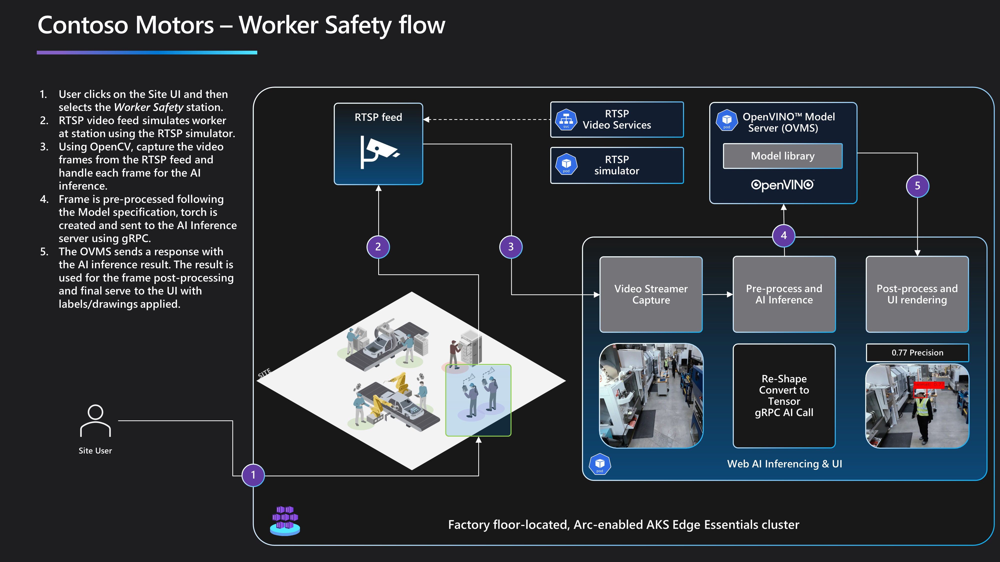
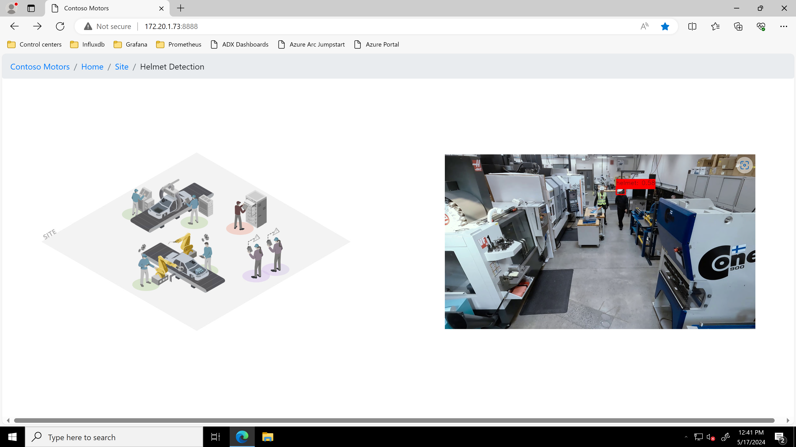

# Enabling AI at the edge to enhance workers safety

## Overview

Contoso Motors uses AI-enhanced computer vision to improve workers' safety by detecting workers with no helmets on the factory floor. Worker safety is one of the four computer vision use cases that Contoso Motors uses, which also include object detection, defect detection, and human pose estimation. While each use case has its own unique characteristics, they all follow the same inferencing architecture pattern and data flow.

## Architecture

This diagram shows the workers safety inference flow, which consists of five main steps: UI selection, RTSP video simulation, frame capturing, image pre-processing/inferencing, and post-processing/rendering.

1. **Select Site UI:** The user selects a working station from the interactive UI. Each station corresponds to a specific AI flow. In particular, when the user selects the two workers walking station (highlighted in the image above), the workers safety flow is triggered.

1. **RTSP video simulation:** The workers safety flow requires a particular video of two workers walking with helmets to apply the AI inference. In this scenario, due to the lack of a real video camera, an RTSP simulated feed is used. The simulated feed is designed to closely mimic the behavior of two workers walking on site with the appropaite safety gear, providing a reliable video for the AI inference process.

1. **Frame capturing:** This step involves using **OpenCV** to establish a connection with the RTSP video feed and retrieve the welding video frames. Each frame is then passed to the appropriate worker safety AI inference class, which applies the required preprocessing and post process to the frame. The worker safety AI inference class is implemented in [yolov8.py](https://github.com/microsoft/jumpstart-agora-apps/blob/main/contoso_manufacturing/developer/webapp-decode/welding.py) and is designed to handle the specific requirements of the worker safety detection process.

1. **Frame pre-processing/inferencing:** This step involves applying various techniques to enhance, transform and normalize the captured frames. For this worker safety model, the image preprocessing consists of the following transformations:
    1. Resize the input image to the specified width and height.
    2. Convert the color space of the input image from BGR to RGB.
    3. Convert the data type of the input image to float32
    4. Transpose the dimensions of the input image from (height, width, channels) to (channels, height, width).
    5. Add a new dimension to the input image at the beginning of the array to create a "batch" of images.

    After the pre-processing step is completed, the final frame data is sent to the OpenVINO™ model server for inference. This is achieved using gRPC and the [ovmsclient](https://pypi.org/project/ovmsclient/) library, which provides a convenient and efficient way to communicate with the server. The server uses the OpenVINO™ toolkit to perform the inference process, which involves running the input data through a trained machine learning model to generate predictions or classifications. Once the inference is complete, the results are returned to the client for further processing or display.

1. **Frame post-processing/rednering:** this is the final step and involves parsing the inference reposnse and apply the required post-process. For this welding model, the post-process involves the following transformations:

    1. Use the OVMS inference result and hte original frame to calculate the bounding box coordinates, scores, and class IDs for each detection in the output tensor.
    1. Apply a non-maximum suppression function to filter out overlapping bounding boxes.
    1. Draw each selected detection on the input image and creates a table of the detection information.
    1. Return the frame with the detections and labels

    Once the image is processed, is then served to the main application to render it to the user. Final image contains the result of the worker safety inference (**helmet**, **head** and **person**) and the probability of the result.

If you're interested in learning more about the AI inference flow, check out the [AI Inference Architecture](./ai_inferencing) page for additional information.

### Model

The model was created by the Arc Jumpstart team, based on the [Yolo8](https://yolov8.com/) model. The model files can be downloaded from [safety-yolo8.bin](https://jsfiles.blob.core.windows.net/ai-models/safety-yolo8.bin) and [safety-yolo8.xml](https://jsfiles.blob.core.windows.net/ai-models/safety-yolo8.xml).

#### Inputs

Image, name: image, shape: 1, 3, 640, 640 in the format B, C, H, W, where:
- B - batch size
- C - number of channels
- H - image height
- W - image width

Expected color order is BGR.

#### Outputs

The output is a torch with the shape 1, 3 containing probability scores for three output classes (**helmet**, **head** and **person**).

## Operation technology (OT) Manager Experience

Contoso uses AI-enhanced computer vision to monitor the safety helmet adherence for workers on the factory floor to help OT managers ensure workers safety through the "Control Center" interface.

- To access the "Control Center" interface, select the Control center [_env_] option from the _Control center_ Bookmarks folder. Each environment will have it's own "Control Center" instance with a different IP. Select one of the sites and click on the factory image to start navigating the different factory control centers.

- Click on the "Site" control center.

  

- Click on the "Workers safety" control center image.

  

- You can now see the AI-enhanced computer vision in action analyzing the video feed to detect if workers are adhering to Contoso's safety helmet policies in the factory floor.

  

## Next steps

Now that you have completed the workers safety scenario, it's time to continue to the next scenario, [Infrastructure observability for Kubernetes and Arc-enabled Kubernetes](../k8s_infra_observability/).
