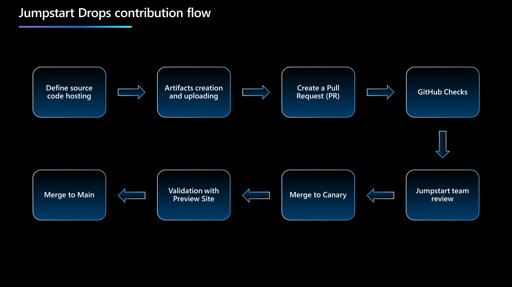
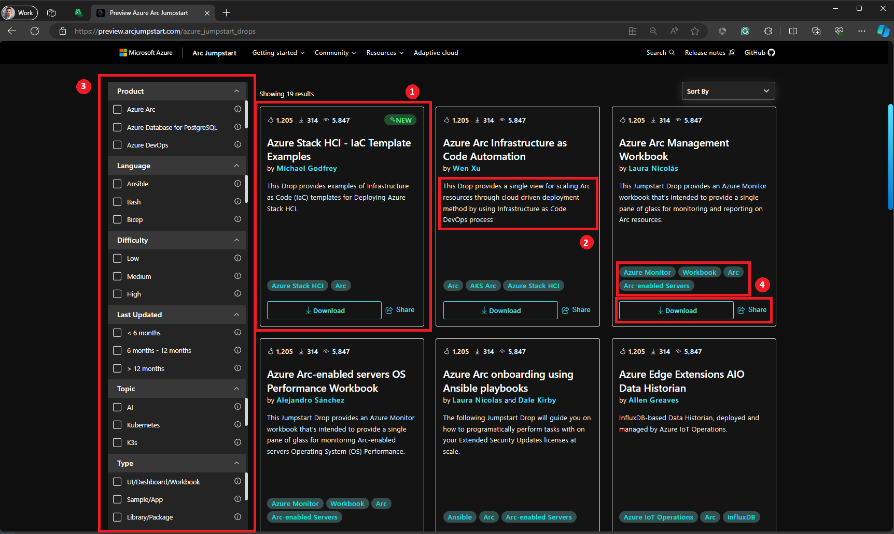
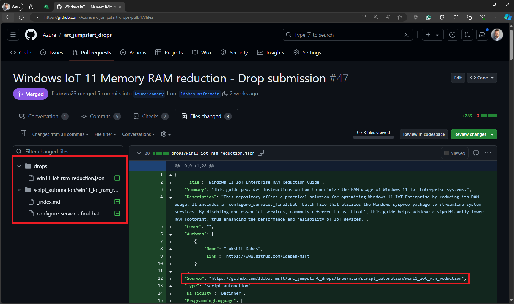
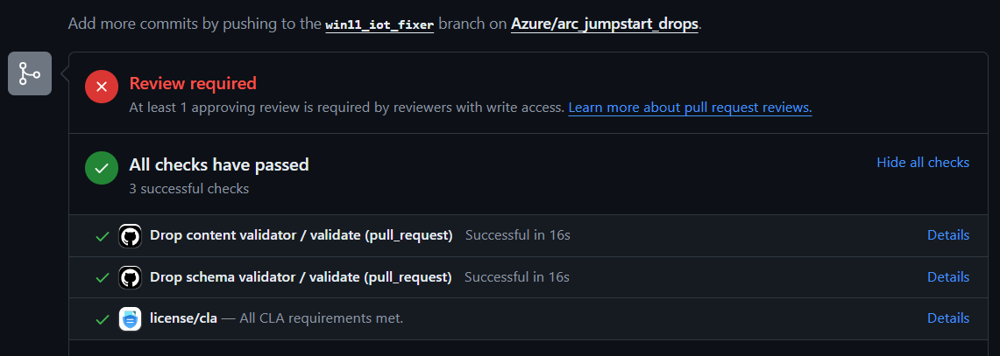
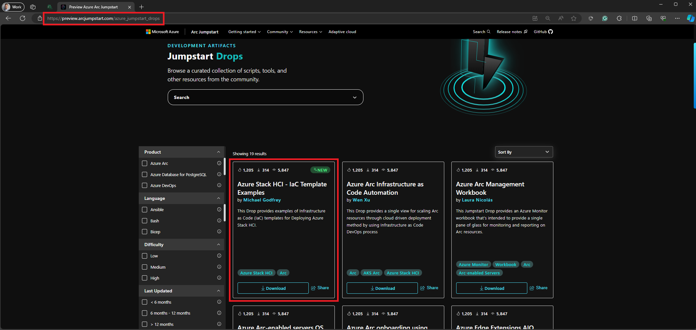
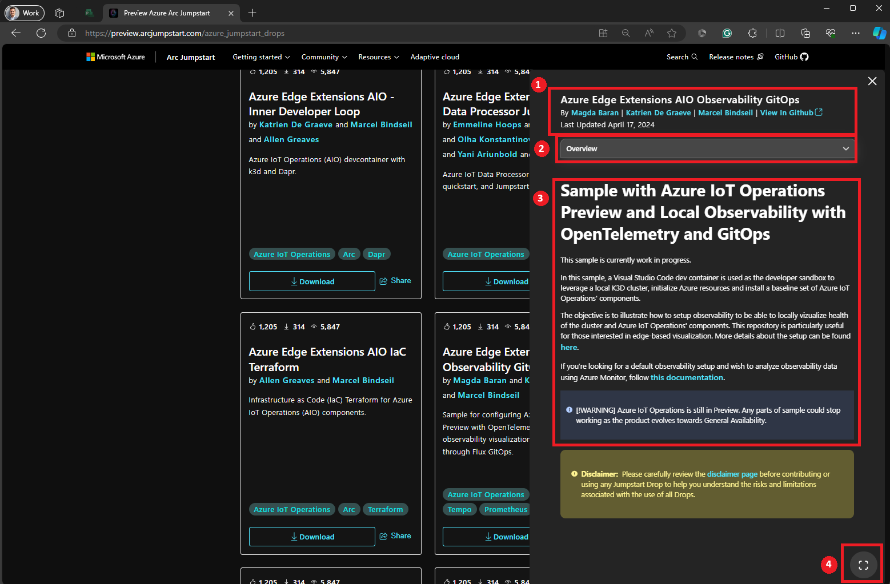
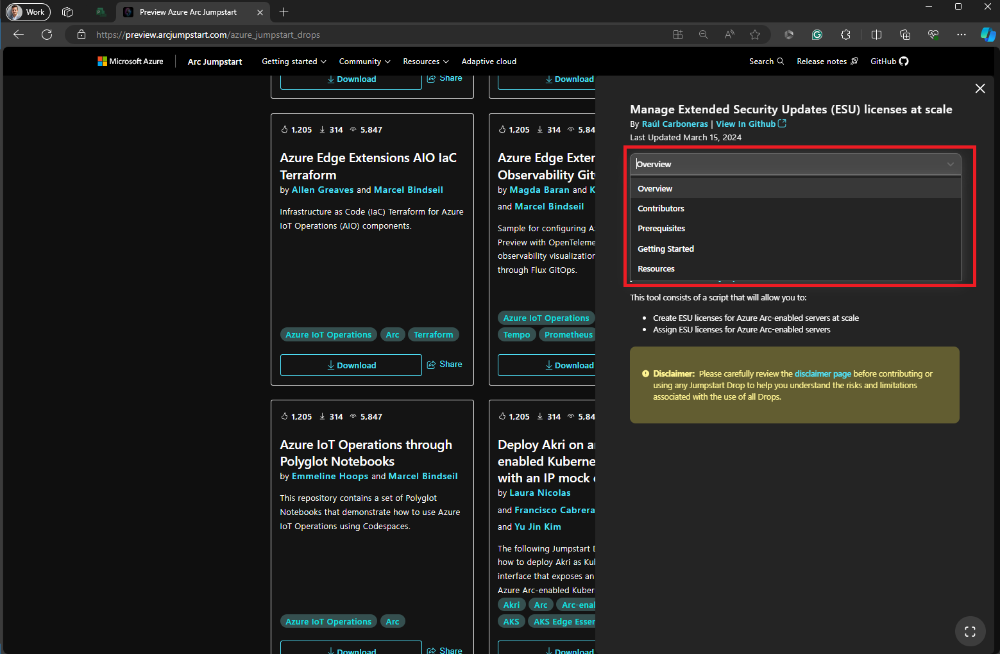
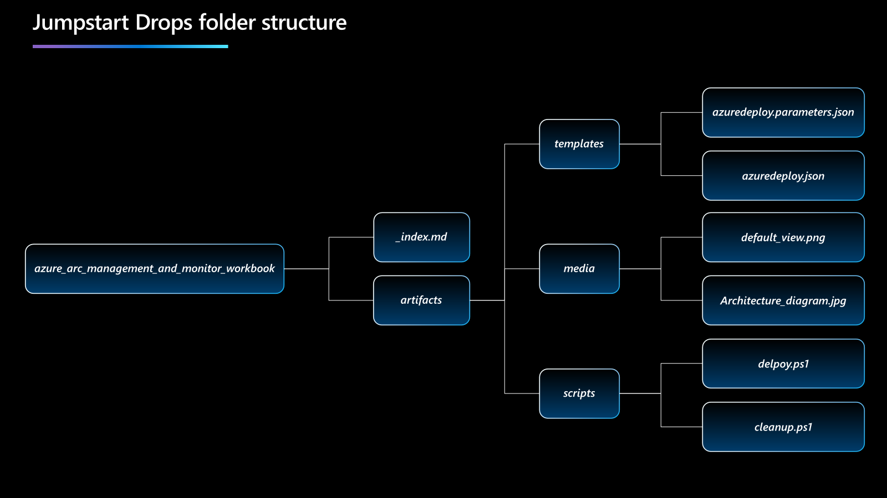

## Jumpstart Drops contribution guidelines

**Welcome to Jumpstart Drops contribution guidelines!**

We welcome contributions following the guidelines described in the Arc Jumpstart [contribution guidelines](./../contribution_guidelines).

Our goal is to create a simplified contribution process for our users that guarantees high-quality standards for all submissions. Contributing a Drop is as simple as opening a GitHub Pull Request following a simple [scheme](https://github.com/Azure/arc_jumpstart_drops/blob/main/SCHEMA.md). We're also working on a streamlined **“Create Drop”** wizard which will walk you through the process step by step, making it effortless to submit your new Drop. With our wizard, you'll also enjoy a live preview of how your contribution will appear on the website. This ensures everything is perfect before sharing it with the community. Stay tuned, we're expecting this wizard to become available on the Jumpstart Drops homepage in the very near future.

The contribution process consists of the following steps:

 

1. **Define source code hosting:** There are two alternatives to host the source code:

    - **Include Code in Pull Request:** Include the code/artifacts in the pull request and host all the content as part of the [Arc Jumpstart Drops repository](https://github.com/Azure/arc_jumpstart_drops).
    - **Reference to Author's Repository:** Keep the code in the author's repository and provide a reference URL under the _"Source"_ in the Drop definition file (check [Drops schema](https://github.com/Azure/arc_jumpstart_drops/blob/main/SCHEMA.md)). Ensure that the repository is publicly available.

1. **Artifacts creation and uploading:** Develop and validate the source code of your Jumpstart Drop and the JSON schema file. Before submitting your pull request, ensure to check the following:
    1. Test your Drop end-to-end in a new, unmodified environment to ensure it works as expected.
    1. Choose a descriptive and actionable title that accurately represents your Drop's purpose. Remember that users will see this title when browsing the Drops gallery and should have a good idea of your Drop just by seeing the Drop's card. 
    1. Provide clear documentation that includes screenshots or videos demonstrating the steps involved and potential outcomes.
    1. Have someone else review your code before submitting it. Don't include any credentials as part of your submission.
    1. Ensure checking the spelling, grammar, and wording of your submission. To help validation, use [Vale](https://vale.sh/), already configured as part of the project. Ensure to use `vale sync` before starting linting, to get the latest configurations.

    The final submission should contain the following files:

    - **Source Code**: Include all the code files you've created, along with any necessary documentation (README, images, videos, etc.). Ensure these files follow the correct structure defined in the [folder structure](#folder-structure) section. 

    - **Drop Definition**: Provide a JSON file with all the required fields as described in the [Drops Schema](https://github.com/Azure/arc_jumpstart_drops/blob/main/SCHEMA.md) definition. This file will be used by the Arc Jumpstart Drops page to create a Drop card with all the necessary information, as you can see in the following image. 

    

    1. Drop card created for each *JSON* definition schema file placed under the [drops](https://github.com/Azure/arc_jumpstart_drops/tree/main/drops) folder, with a unique *Title* and *Authors*. The name should be unique, have a proper description, and use **snake_case**.
    1. Description of the Drop
    1. Filter bar to filter Drops based on the metadata of the Drop, like tags, products, creation date, and topics.
    1. Tags and action buttons: _Download_ and _Share_.

1. **Create Pull Request to Canary**: Submit your pull request (PR) to the Canary branch of [Arc Jumpstart Drops](https://github.com/Azure/arc_jumpstart_drops). 

    For example, the following Drop submission aims to contribute the code to the [arc_jumsptart_drops](https://github.com/Azure/arc_jumpstart_drops) repository, hence as part of the pull request you can see the `win11_iot_ram_deduction.json` file under the `drops` folder, and then the artifacts under the `script_automation/win11_iot_ram_deduction` folder. Also, you can see that the *Source* is pointing to the [arc_jumsptart_drops](https://github.com/Azure/arc_jumpstart_drops) repository. 

    

1. **GitHub Checks**: As part of the validation process, there are multiple [GitHub Actions](https://github.com/Azure/arc_jumpstart_drops/actions) that run during the pull request review process to ensure:
    - Drop JSON schema definition and folder structure.
    - [MIT licensing](https://github.com/Azure/arc_jumpstart_drops?tab=MIT-1-ov-file#readme) and Microsoft CLA license check.
    - CodeQL for vulnerabilities.
    - [Vale.sh](https://vale.sh/) linter for documentation grammar and styling. 

    When creating a pull request, you'll see your checks running for ~2-3 minutes. Carefully review the result of the checks, and fix any errors found on your submission.

     

1. **Manual review from Jumpstart Core maintainers**: Reviewers will be added based on the products and type of Drop submitted. The PR can only be merged if all GitHub checks pass and at least 2 reviewers approve the submission.

1. **Merge to Canary**: If everything is correct, the PR will be merged to the **canary** branch, and the new Drop will be part of the approved Drops curated list. 

1. **Validation with Preview Site**: Validate the changes using the [Preview Azure Arc Jumpstart site](https://preview.arcjumpstart.com/azure_jumpstart_drops). Ensure to check that your Drop is rendering correctly. Take some time to review the Drop card, and once finished, review the right-sidebar with all the context from your _README.md_ or _Index.md_.

    

1. **Merge to Main**: Finally, once the **Canary** branch is merged to **Main** and published to Production, the Drop will be available as part of [Azure Arc Jumpstart Drops](https://arcjumpstart.com/azure_jumpstart_drops).

## Drop Index

When you select a Drop for more information, a right-sidebar will appear, displaying a more detailed view of the Drop. The content of the right bar is based on the *_README.md_ or _Index.md_ file of the Drop's source code, which is used to render different sections. To ensure that the right bar displays all the relevant information, headers (H2, H3, or H4) must be included in the _README.md_ or _Index.md_ file. 

  

When accessing the right-sidebar, you'll be presented with the following sections:

1. **Metadata header**: This section will display important information from the Drop JSON schema file, allowing you to quickly and easily access key details about your Drop data.
1. **Section selector**: A dropdown menu will enable you to choose from different sections of the Drop Index file, making it easy to navigate through the Drop documentation.
1. **Selected content**: Once you've chosen a section, the content will be displayed, allowing you to view the information you need without having to navigate away from the page.
1. **Full-screen mode**: If you need more space to work with, you can switch to full-screen mode with the click of a button, giving you a larger view of your data and making it easier to work with.

To help contributors write effective documentation for their Drop Index page, we recommend including the following sections:

- **Overview**: This section should provide a detailed description of the Drop, including any important notes or information that users need to be aware of before running it.
- **Prerequisites**: This section should list all the prerequisites that need to be configured before running the Drop. For each prerequisite, we encourage authors to be descriptive about the specific version (if needed) and provide appropriate documentation links on how to configure it.
- **Getting Started**: This section should provide detailed instructions on how to run the Drop, including a quick start approach and coverage of the different configurations and parameters available. This section assumes that the prerequisites are already satisfied. If there's a way to run the Drop with one command, we recommend including it and explaining the different variables/parameters that could be used.
- **Resources**: This section should list resources that users can use to find helpful information regarding the Drop and the products/prerequisites used.
- **Others**: This section will render the content for all other headers that don't match the above. 

It's important to note that while the sections described above are recommended for an optimal user experience, contributors are free to use their own layouts and sections. If no matching sections are found, all content will be rendered in a single tab labeled **Overview**.

For example, if the **Manage Extended Security Updates (ESU) licenses at scale** contains an _index.md_ that contains the _Overview_, _Contributors_, _Prerequisites_, _Getting started_ and _Resources_ sections, the right-bar will render as the following image:

## Folder structure

The folder structure guidelines for submitting Drop source code as part of a Pull Request into the Arc Jumpstart Drops repository are as follows:

1. Create a root folder with the name of the Drop using **snake_case**. For example, *azure_arc_management_and_monitor_workbook*.

1. Inside the root folder, include a file named *_index.md* that serves as a README file for the Drop. This file should provide a brief introduction and overview of the Drop, its objectives, prerequisites, deployment steps, and any additional resources or references.

1. Create a new folder named *artifacts* inside the root folder. This folder should contain all the files and scripts necessary to run the Drop.

1. Optionally, create a new folder named *media* inside the artifacts folder. This folder can contain any screenshots or architecture diagrams that showcase the Drop.
